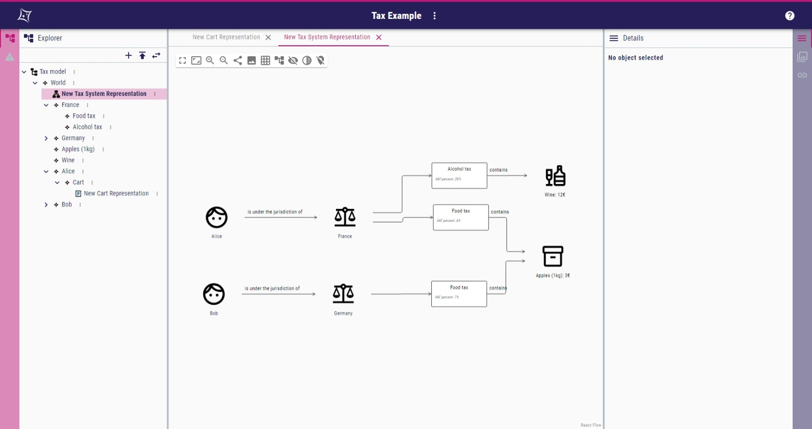
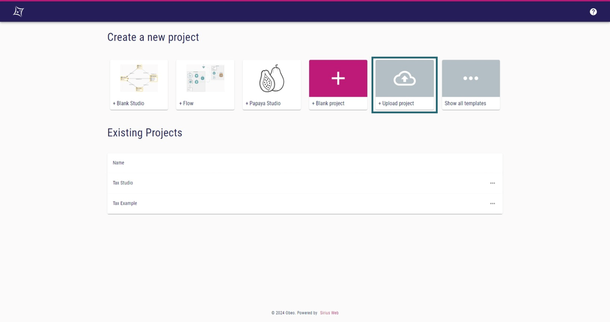

= Tax Studio

This repository contains the sources of the Tax Studio for https://github.com/eclipse-sirius/sirius-web[Sirius Web] 2024.1.2. +
This studio allows the calculation of the price of the customer's cart with the applied VAT (_Value-Added Tax_) according to the jurisdiction of the customer.
The studio offers two activities for the end user: 

* modeling of the different jurisdictions and VATs within them, as well as the customers residing in those and the products subject to the VATs; 
* defining the content of a customer's cart, with computation of the price based on the customer's jurisdiction.

Each activity has its own representation: a diagram representation for the modeling of the jurisdiction and a form representation for defining a customer's cart. +
<<tax_diagram,Figure 1>> illustrates the first activity.

[#tax_diagram]
.A Tax model made with the tax studio, viewed according to the first activity

[#install_sirius_web]
== How to install Sirius Web?

To use the Tax Studio, Sirius Web is required. +
You can follow the installation process outlined in the https://github.com/eclipse-sirius/sirius-web[original repository] to install it.

[#install_tax]
== How to install the Tax Studio and its example?

. Download the `tax_studio.zip` and `tax_example.zip` files from repository.
. Import them into Sirius Web using the "Upload project" tile shown in <<homepage,Figure 2>>.
. You can switch between the two projects to see how the studio is defined (Tax Studio) and an example of use (Tax Example).
. You can choose the representation to open from the design view when none is open, as shown in <<open_representation,Figure 3>>.

[#homepage]
.The homepage of Sirius Web. Boxed in blue, the tile to upload a new project

[#open_representation]
.The default page of a Sirius Web project when no representation is open. Boxed in blue, the list of representations of the project.

