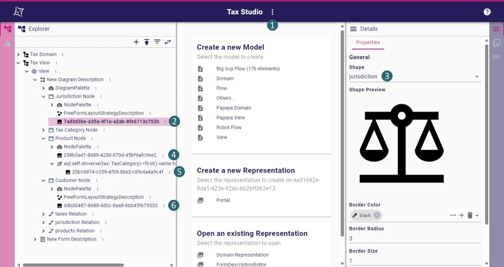
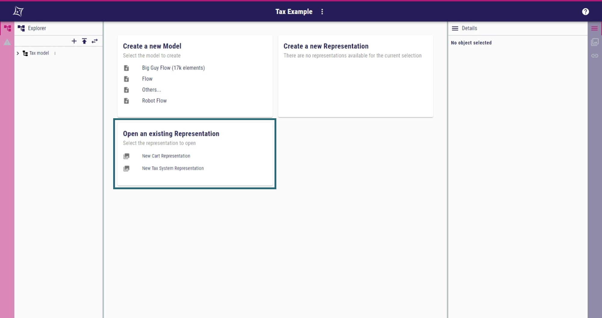

= Tax Studio

This repository contains the sources of the Tax Studio for https://github.com/eclipse-sirius/sirius-web[Sirius Web] 2024.1.2. +
This studio allows the calculation of the price of the customer's cart with the applied VAT (_Value-Added Tax_) according to the jurisdiction of the customer.
The studio offers two activities for the end user: 

* modeling of the different jurisdictions and VATs within them, as well as the customers residing in those and the products subject to the VATs; 
* defining the content of a customer's cart, with computation of the price based on the customer's jurisdiction.

Each activity has its own representation: a diagram representation for the modeling of the jurisdiction and a form representation for defining a customer's cart. +
<<tax_diagram,Figure 1>> illustrates the first activity.

[#tax_diagram]
.A Tax model made with the tax studio, viewed according to the first activity

[#install_sirius_web]
== How to install Sirius Web?

To use the Tax Studio, Sirius Web is required. +
You can follow the installation process outlined in the https://github.com/eclipse-sirius/sirius-web[original repository] to install it.

[#install_tax]
== How to install the Tax Studio and its example?

. Download the `tax_studio.zip` and `tax_example.zip` files, and the four SVG images from the repository.
. Import them into Sirius Web using the "Upload project" tile shown in <<homepage,Figure 2>>.
. Currently, Sirius Web does not export the images used in the concrete syntax when exporting a studio. 
<<define_images,Figure 3>> illustrates how to import them manually:
.. Open the Tax Studio project and go to the settings (❶) to upload the different images.
   Give them the name of the image as a label.
   To return to the project, you can use your browser's "go back" feature or click the Sirius Web icon to go to the home page.
.. Click on the first image style in the Tax View model (❷) and change the shape to select _jurisdiction_ (❸).
.. Repeat the same step for the other image styles (❹-❻).
   The image style ❺ must have as shape the alcohol image. It is a conditional style that is applied only when a tax category of a product contains the word "alcohol".
. Now, you can switch between the two projects to see how the studio is defined (Tax Studio) and an example of use (Tax Example).
. You can choose the representation to open from the design view when none is open, as shown in <<open_representation,Figure 4>>.

[#homepage]
.The homepage of Sirius Web. Boxed in blue, the tile to upload a new project

[#define_images]
.The Tax Studio project opened. The numbers in blue represent the ordered steps to import the images and use them to represent the different concepts.

[#open_representation]
.The default page of a Sirius Web project when no representation is open. Boxed in blue, the list of representations of the project.

